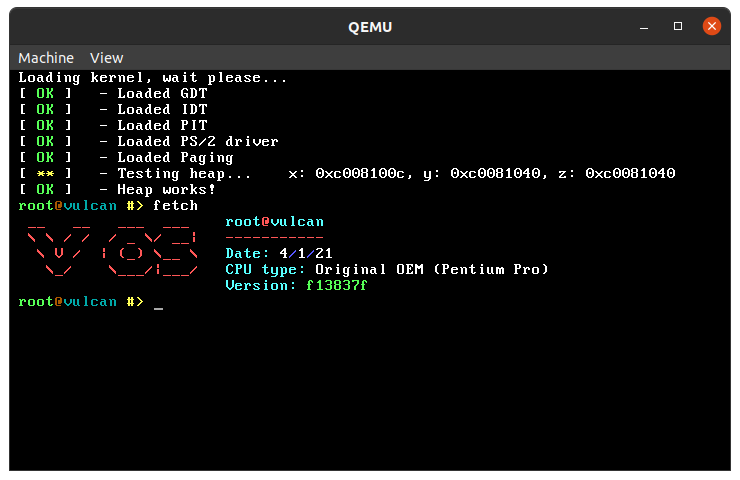

# VulcanOS  
**VulcanOS** is a x86 monolithic kernel written in C from scratch following the UNIX philosophy. This project is just a student learning tool to know more about operating systems, do not expect nothing more than a toy.

<h6><i>VulcanOS running under QEMU</h6></i>

  

## Installation
### Requirements
Before building this project you need to setup a [cross compiler](https://wiki.osdev.org/GCC_Cross-Compiler). Also install the following packages:  

- nasm
- bochs
- grub
- mtools(only for Arch Linux)

After that, you can build iceOS just by running the command listed below.  
1. Type `make all` to compile the system and to create an ISO
2. Type `make run` to start it in QEMU or `make bochs` to start it with bochs(only for debug purposes).

You can also find a ISO file 
[here](https://github.com/ice-bit/vulcanos/raw/master/imgs/vulcanos.iso)(md5sum: `a706cdfeea573e08550e599717d3f519`)

## Features
iceOS has the following features:  
- [x] VGA driver  
- [x] Interrupts  
- [x] PIC & PIT driver  
- [x] PS/2 driver  
- [x] Heap  
- [x] Paging
- [ ] VFS driver  
- [ ] Usermode

## License
VulcanOS is released under GPLv3, you can obtain a copy of this license by cloning this repository or by visiting [this](https://opensource.org/licenses/GPL-3.0) page.
