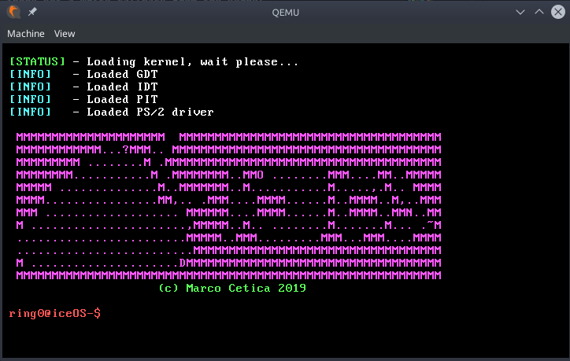

  

  

<h6><i>Simple kernel written in C for Intel x86 CPUs</i></h6>

# About iceOS

<h6><i>iceOS running under QEMU</h6></i>

  

**iceOS** is a x86 monolithic kernel written in C from scratch.  
This project doesn't aim to be a fully functional operating system
with tons of drivers and graphical applications, it's just a learning tool to teach myself concepts like Operating Systems, Computer Architecture and Digital Electronics.

## Installation
### Requirements
Before generating an ISO you have to compile a [cross compiler](https://wiki.osdev.org/GCC_Cross-Compiler) and you also have to install those packets:

- nasm
- bochs
- grub
- mtools(if you are on Arch Linux)

Then you can run those commands:
1. Type `make all` to compile the system and to create an ISO
2. Type `make run` to start it in QEMU or `make bochs` to start it with bochs(only for debug purposes).

Otherwise you can download an already compiled ISO file 
[here](https://github.com/ice-bit/iceOS/raw/master/imgs/iceOS.iso)(md5sum: `ab3d5b8307015461b44e62d0c2d42806`)

## Features
iceOS already have/will have the following features:  
- [x] Bare metal booting;
- [x] VGA driver;
- [x] Interrupts implementation;
- [x] PIC & PIT implementation;
- [x] PS/2 driver;
- [x] Support for x86 architecture;
- [x] GRUB as bootloader;

## Resources
This project is made with different kind of resources and different kind of knowledges, before starting it i read/studied the following resources:

- [Structured Computer Organization - Tanenbaum (2013)](https://www.pearson.it/opera/pearson/0-5585-architettura_dei_calcolatori_6ed)
- [Operating System Concepts - Silberschatz (2016)](https://www.amazon.it/Sistemi-operativi-Concetti-ed-esempi/dp/8865183713/ref=pd_lpo_sbs_14_img_1?_encoding=UTF8&psc=1&refRID=4A5T2C7KKH7RA0K1T7RV)
- [The Art Of Electronics - Horowitz (2015)](https://www.amazon.it/gp/product/0521809266/ref=ppx_od_dt_b_asin_title_s00?ie=UTF8&psc=1)
- [OSDev wiki](https://wiki.osdev.org/Main_Page)
- [The Little Book About OS Development](https://littleosbook.github.io/)
- [I actually started this project due to skiftOS](https://github.com/skiftOS/skift)
## License
iceOS is released under GPLv3, you can obtain a copy of this license by cloning the repository or by visiting [this](https://opensource.org/licenses/GPL-3.0) page.
